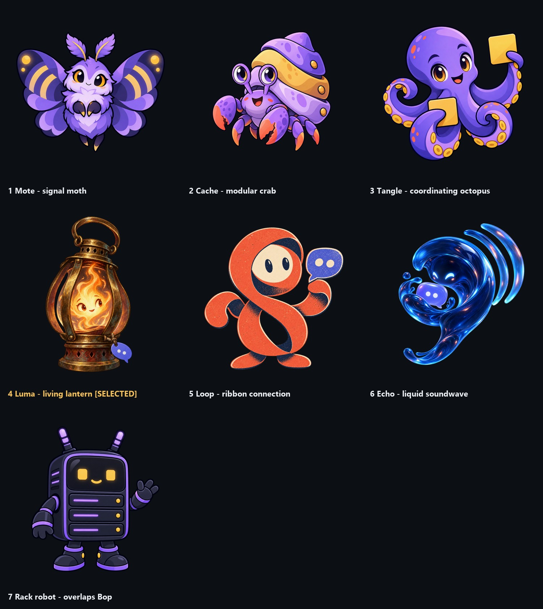

# Mascot exploration for rackbops-discord-bot

Seven concepts were explored. **Luma (#4) was selected** for the bot; its final, handle-complete master and favicon package live in [`../`](../README.md). These images are concept art, not seven production identities. Each PNG has transparency; the comparison sheet uses a dark display field.

| # | Concept | Visual treatment | Why it was considered | Status |
|---|---|---|---|---|
| 1 | [Mote, signal moth](01-mote-moth.png) | Polished geometric illustration | Wing spots and arcs suggest signals reaching a community | Unselected; future candidate |
| 2 | [Cache, modular crab](02-cache-crab.png) | Polished geometric illustration | Layered shell suggests a host carrying plugins | Unselected; future candidate |
| 3 | [Tangle, coordinating octopus](03-tangle-octopus.png) | Polished geometric illustration | Multiple arms coordinate messages and tools | Unselected; future candidate |
| 4 | [Luma, living lantern](04-luma-lantern.png) | Painted gouache and ink | A steady light carries conversation; blurple charm nods to Discord | **Selected for this bot** |
| 5 | [Loop, ribbon connection](05-loop-ribbon.png) | Textured mid-century screen print | One continuous shape expresses routing and connection | Unselected; future candidate |
| 6 | [Echo, liquid soundwave](06-echo-wave.png) | Cinematic liquid/glass rendering | Motion and a protected chat bubble express delivery | Unselected; future candidate |
| 7 | [Rack robot](07-rack-robot.png) | Polished geometric illustration | Literal server-rack bot | Exploration only; overlaps existing Bop |

The first three share too much of one illustration style; the second three intentionally test very different media. #7 records the initial robot exploration at the user's request. It should not be adopted as another Rackbops mascot without resolving its overlap with [Bop](https://github.com/Rackbops/rackbops/blob/main/brand/README.md), the existing rack-unit robot.

The unselected concepts are archived as future ideas in `R:/repos/Tooling/assets/mascot-ideas-2026-09/`. That archive includes their source concept PNGs, a comparison sheet, and a fuller fit/usage writeup. A future project should check its own existing brand before adopting any of them.
